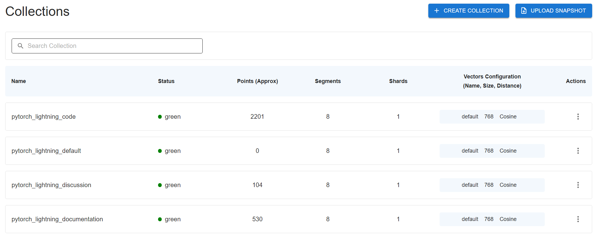

### Installation

```bash

pip install qdrant-client==1.15.1 rank_bm25 numpy 

# install torch by official guide
```

```bash
# For qdrant, we shall run the backend in a docker

docker run -p 6333:6333 -p 6334:6334 \
    -v "$(pwd)/.cache:/qdrant/storage:z" \
    qdrant/qdrant
```

### Quick Run 
Get into RAG directory, and set up the python environment.

```bash
cd RAG
pip install -r requirements.txt
```

To use the LLM integration, first you need to set the `RAG/config/config/yaml`. As default, it reqires an api key from [google ai studio](https://aistudio.google.com/app/api-keys), which is free to get.
```yaml
llm:
  provider: "google"
  model_name: "gemini-2.5-flash" # Options: gemini-1.5-flash, gemini-1.5-pro
  # api_key_env_var: "GEMINI_API_KEY"
  api_key_env_var: "Your_api_Key"
  temperature: 0.1
  max_tokens: 1024
```

The default vector database is qdrant, so make sure you have set up the qdrant docker and it's running on [localhost:6333](http://localhost:6333/dashboard#/collections). 

Then run the `pipeline.py` in `query` mode to test our RAG system. It wkk automatically build the RAG system and store the data. You may see the collections of qdrant after finishing embedding on the [qdrant portal](http://localhost:6333/dashboard#/collections).



Note that, first time quering may encounter spilted output. You may re-run the cmd again to solve it.

```bash
python pipeline.py --mode query --index-dir saved_index
```

The cmd will create a interactive interface for you to input the query, it will retrieve top-5 result and generate a answer using LLM for the query.

A sampel output should be like in the [sample_output](./RAG/utils/sample_output.txt)
